# homebase

A self-hosted CMDB and status dashboard for your domains, subscriptions, servers, and apps.

homebase keeps one inventory of everything your home lab and online presence depend on: which provider each thing lives at, what it costs, when it renews, and whether it is up.
It is a Django + Postgres app that you run yourself, designed to live on a trusted network such as your LAN or a Tailscale tailnet rather than on the open internet.
Provider APIs are read with read-only tokens, and every token is optional.

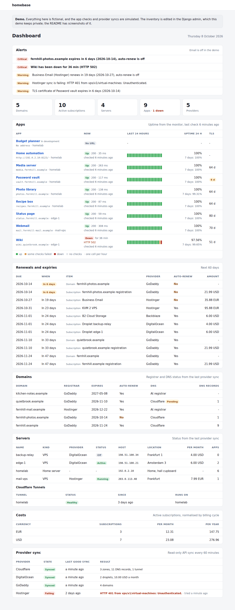

## Screenshots

Every screenshot comes from a `DEMO_MODE` instance filled by `manage.py seed_demo`, so all names, domains, addresses, and prices are fictional.
Light and dark themes follow the browser setting.

| | Light | Dark |
| --- | --- | --- |
| Dashboard |  | 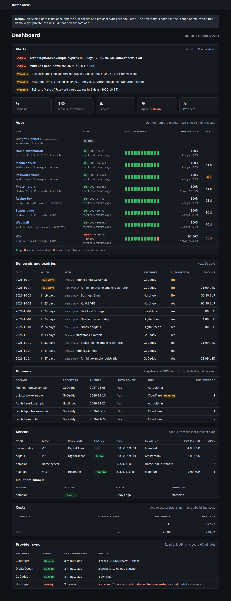 |
| App page | 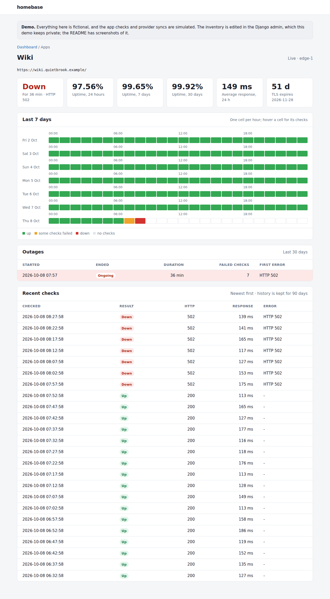 | 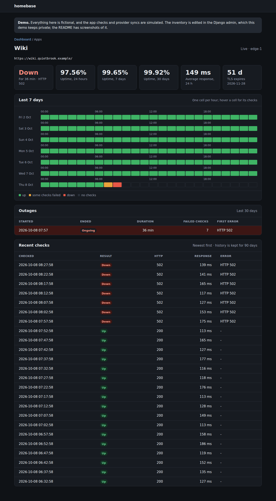 |
| Admin change form | 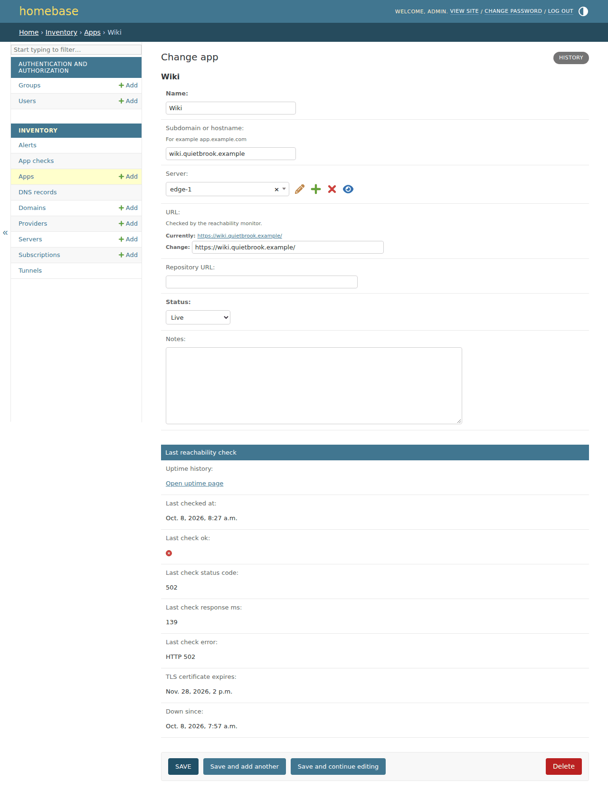 | 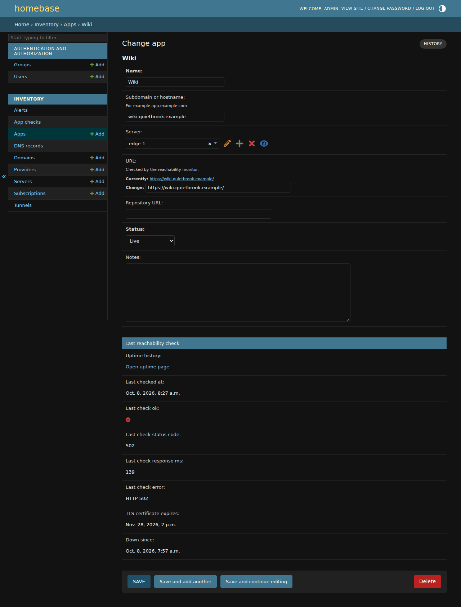 |

On a phone:

| | Light | Dark |
| --- | --- | --- |
| Dashboard |  |  |
| App page | 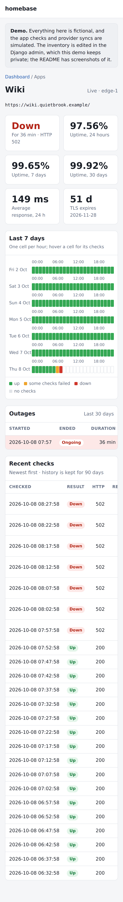 | 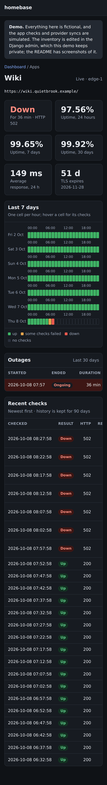 |
| Admin change form | 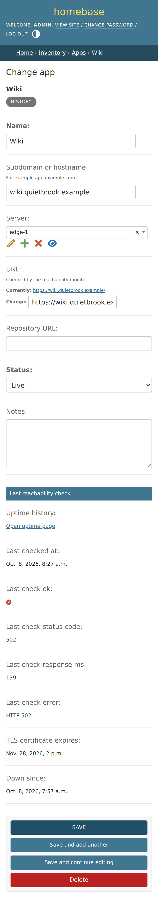 | 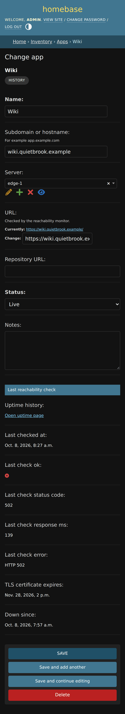 |

## Quickstart

Requirements: Docker with the Compose plugin.

```sh
git clone https://github.com/adrianprofir/homebase.git
cd homebase
cp .env.example .env
```

Edit `.env`: set `SECRET_KEY` (generate one with `python3 -c "import secrets; print(secrets.token_urlsafe(50))"`) and `POSTGRES_PASSWORD` (use a URL-safe value such as `openssl rand -hex 32`).
Then start the stack and create your login:

```sh
docker compose up -d --build
docker compose exec web python manage.py createsuperuser
```

Open <http://127.0.0.1:8000/>, log in, and add your inventory through the **Admin** link.
The stack publishes the dashboard on `127.0.0.1:8000` by default.
To reach it from other machines on your network, set `HOMEBASE_BIND_ADDRESS` to the server's LAN address and add that address to `ALLOWED_HOSTS` and `CSRF_TRUSTED_ORIGINS` in `.env`.
[docs/deploy-home-server.md](docs/deploy-home-server.md) walks through a complete home-server setup with LAN and Tailscale access and nightly backups.

## Features

- **Inventory**, edited through the Django admin at `/admin/`:
  - **Providers** such as GoDaddy, Cloudflare, Hostinger, and DigitalOcean, with website and account notes.
  - **Domains** with registrar, DNS provider, expiry date, and auto-renew flag.
  - **Subscriptions** with cost, currency, billing cycle, next renewal date, and auto-renew flag.
    A subscription can point at the domain it registers or the server plan it pays for.
  - **Servers**: your own machines, shared hosting, and VPSes, with public IP or hostname and location.
  - **Apps** with hostname, the server they run on, an http or https URL, repository URL, and status.
- **Live provider data**, read from the provider APIs with read-only tokens (see [Provider tokens](#provider-tokens)):
  - **Cloudflare**: zone status and DNS records of every domain in the inventory, and the status of each Cloudflare Tunnel.
  - **GoDaddy**: every domain in the account, with expiry date, auto-renew, and registrar status.
  - **DigitalOcean**: droplets with status and monthly price.
  - **Hostinger**: VPS state, and every billing subscription with price, next renewal date, and auto-renew.
  - Each provider is optional and is skipped when its token is not set.
    The dashboard shows when each provider last synced and the exact error when a sync fails.
- **Uptime checks** of every app URL: HTTP status, response time, and TLS certificate expiry, with 90 days of history.
  The dashboard shows a 24-hour strip per app, and each app has a page with a 7-day view, outages, and recent checks.
- **Alerts** for domain expiry, subscription renewals, TLS certificate expiry, sustained downtime, and failing provider syncs.
  They are listed at the top of the dashboard and, when SMTP is configured, emailed once when raised, again if they turn critical, and once when resolved.
- **Dashboard** at `/` (login required):
  - Alerts, then summary counts, including how many apps are currently down.
  - Apps with current status, last 24 hours, uptime, and days until the TLS certificate expires.
  - Renewals and expiries due in the next 60 days, with overdue items highlighted.
  - Domains with registrar and DNS status, servers with provider status and monthly cost, and Cloudflare Tunnels.
  - Monthly and yearly cost totals of active subscriptions, per currency.
  - Provider sync state.
  - A red banner when the monitor has stopped running, since a stopped monitor cannot alert about itself.
  - The page refreshes itself every five minutes.


### How the monitor works

`python manage.py monitor` does one monitoring run, and Docker Compose repeats it every `CHECK_INTERVAL_SECONDS` in the `checker` service:

1. **Provider sync** for every provider whose token is set and whose last sync is older than `HOMEBASE_SYNC_INTERVAL_MINUTES`.
   It only sends GET requests and never changes anything at the provider.
   Each provider's result is applied in one database transaction, so a failed sync changes nothing and records its error instead.
2. **App checks**: an HTTP GET to every non-retired app with a URL.
   A response below 400 after redirects is up; anything else, or no response, is down.
   For https URLs it also reads when the certificate expires.
   Every result is kept as history, and changing or clearing an app's URL starts its status and history afresh.
3. **History cleanup**: checks older than `HOMEBASE_CHECK_HISTORY_DAYS` are deleted.
4. **Alerts**: alerts are raised and resolved, and email goes out if it is configured.

Each step runs even when an earlier one crashed, and the command exits non-zero with the traceback in the logs when one did.
`docker compose logs checker` shows every run.

The steps also exist as separate commands: `sync_providers` (with `--provider cloudflare` to sync just one, now), `check_apps`, and `update_alerts`.

### What the provider sync writes

Provider data is matched to the inventory rather than kept beside it:

- **Domains** are matched by name.
  GoDaddy adds the domains it holds that are missing from the inventory, and keeps registrar, expiry date, and auto-renew current.
  An active subscription that registers the domain gets the same renewal date.
  A domain that disappears from the account is marked missing; a transferred-out one keeps its dates.
- **DNS**: a domain whose Cloudflare zone is active gets Cloudflare as its DNS provider, and its DNS records are replaced on every sync.
  The records are read-only in the admin, linked from the dashboard.
  Zones for domains that are not in the inventory are named in the sync result; add the domain to see them.
- **Servers** are matched by provider ID, then by name or address among that provider's servers; unmatched droplets and VMs are added.
  A server whose droplet or VM is gone is marked missing.
- **Subscriptions** that a provider bills are created or kept current: one monthly plan per droplet, and every Hostinger billing subscription.
  On the first sync a subscription you entered by hand is adopted when it is the only one for that server, or has the same name.
  If a duplicate appears anyway, delete one and clear or set **provider ID** on the other.
- Provider-owned fields (status, provider ID) are shown read-only in the admin.

### Alert rules

| Alert | Warning | Critical |
| --- | --- | --- |
| Domain expiry, auto-renew off | within `HOMEBASE_EXPIRY_ALERT_DAYS` (30) | within 7 days, or expired |
| Domain expiry, auto-renew on | within 7 days | expired |
| Subscription renewal, auto-renew off | within `HOMEBASE_EXPIRY_ALERT_DAYS` (30) | within 7 days, or overdue |
| Subscription renewal, auto-renew on | renewal date passed | - |
| TLS certificate of a live https app | within `HOMEBASE_TLS_ALERT_DAYS` (10) | within 3 days, or expired |
| Live app down | - | failing for `HOMEBASE_DOWNTIME_ALERT_MINUTES` (10) |
| Provider sync failing | latest sync failed | - |

A subscription that registers a domain does not alert on its own: the domain's expiry alert covers it.
An auto-renewing subscription whose date has passed usually just needs its next renewal date updated, which providers with a sync do by themselves.
Apps that are paused or in development are checked but never alert.
The dashboard works the alerts out on every page load, so an edit in the admin shows immediately; email follows on the next monitor run.

## Configuration

All settings come from environment variables, read from a `.env` file in the repository root when present.
Copy `.env.example` to `.env` and fill it in; `.env` is git-ignored and must never be committed.
The Docker Compose quickstart above reads the same file.

| Variable | Purpose |
| --- | --- |
| `SECRET_KEY` | Django secret key. Required. |
| `DEBUG` | `true` only for local development. |
| `ALLOWED_HOSTS` | Comma-separated hostnames and IPs the dashboard is reached by. |
| `CSRF_TRUSTED_ORIGINS` | Extra origins allowed to submit forms, such as `https://homebase.example`. Only needed behind a reverse proxy. |
| `TIME_ZONE` | Time zone used for "today" and displayed times, for example `Europe/Copenhagen`. |
| `DATABASE_URL` | Postgres URL for local development. Docker Compose builds its own from `POSTGRES_*`. |
| `HOMEBASE_DEFAULT_CURRENCY` | Currency pre-filled on new subscriptions. |
| `HOMEBASE_RENEWAL_WINDOW_DAYS` | How far ahead the dashboard looks for renewals (default 60). |
| `HOMEBASE_CHECK_TIMEOUT_SECONDS` | Timeout per app check (default 10). |
| `HOMEBASE_CHECK_HISTORY_DAYS` | Days of uptime history to keep (default 90). |
| `CLOUDFLARE_API_TOKEN`, `GODADDY_API_TOKEN`, `DIGITALOCEAN_API_TOKEN`, `HOSTINGER_API_TOKEN` | Read-only provider tokens; see [Provider tokens](#provider-tokens). Each is optional. |
| `CLOUDFLARE_ACCOUNT_ID` | Only needed to list tunnels when the Cloudflare token can see no zones. |
| `HOMEBASE_SYNC_INTERVAL_MINUTES` | Minutes between provider syncs (default 60). |
| `HOMEBASE_SYNC_TIMEOUT_SECONDS` | Timeout per provider API request (default 30). |
| `HOMEBASE_EXPIRY_ALERT_DAYS` | Days ahead that manual domain and subscription renewals start to warn (default 30). |
| `HOMEBASE_TLS_ALERT_DAYS` | Days ahead that TLS certificates start to warn (default 10). |
| `HOMEBASE_DOWNTIME_ALERT_MINUTES` | Minutes a live app must fail before it alerts (default 10). |
| `EMAIL_HOST`, `EMAIL_PORT`, `EMAIL_HOST_USER`, `EMAIL_HOST_PASSWORD`, `EMAIL_USE_TLS`, `EMAIL_USE_SSL` | SMTP server for alert email. Leave `EMAIL_HOST` empty to keep email off. |
| `DEFAULT_FROM_EMAIL` | Sender address of alert email. |
| `HOMEBASE_ALERT_EMAIL_TO` | Comma-separated alert email recipients. Email is sent only when this and `EMAIL_HOST` are set. |
| `HOMEBASE_DASHBOARD_URL` | Dashboard address used for links in alert email, such as `http://192.0.2.10:8090/`. |
| `POSTGRES_DB`, `POSTGRES_USER`, `POSTGRES_PASSWORD` | Database created by Docker Compose. |
| `HOMEBASE_BIND_ADDRESS`, `HOMEBASE_PORT` | Host address and port the dashboard is published on by Docker Compose. |
| `CHECK_INTERVAL_SECONDS` | Seconds between monitor runs in Docker Compose (default 300). The dashboard flags the monitor as stalled after three missed runs. |
| `HOMEBASE_TAILSCALE_ADDRESS` | Tailscale address the home-server override also publishes the dashboard on (see [docs/deploy-home-server.md](docs/deploy-home-server.md)). |
| `HOMEBASE_BACKUP_DIR` | Host directory `deploy/backup.sh` writes database dumps to (home-server override). |
| `SESSION_COOKIE_SECURE`, `CSRF_COOKIE_SECURE` | Set to `true` once homebase is served over HTTPS. |
| `TRUST_X_FORWARDED_PROTO` | Trust the `X-Forwarded-Proto` header from a reverse proxy that terminates HTTPS. Only when clients cannot reach homebase directly. |
| `SECURE_SSL_REDIRECT` | Redirect plain HTTP to HTTPS. `/healthz` is exempt. |
| `SECURE_HSTS_SECONDS` | Turn on HSTS for this many seconds (default 0, off). Start small: browsers remember it. |
| `DEMO_MODE` | Run a public, read-only demo on fictional data; see [Demo mode](#demo-mode). |
| `MAIN_SITE_URL` | Adds a strip above the header that links back to this site. Empty: no strip. |

Generate a secret key with:

```sh
python3 -c "import secrets; print(secrets.token_urlsafe(50))"
```

`/healthz` answers `ok` when the database is reachable, whatever `ALLOWED_HOSTS` lists, for container and proxy healthchecks.

## Provider tokens

homebase only reads from the providers.
Give each token the smallest access the provider allows, put it in `.env` (which is `chmod 600` on the server), and restart the stack with `docker compose up -d`.
The next monitor run syncs it; to sync at once and see the result, run `docker compose exec checker python manage.py sync_providers --provider <name>`.
Set an expiry where the provider allows one, and note it in your calendar: an expired token shows up as a failing sync and an alert.

### Cloudflare

Needs read access to zones, DNS, and tunnels.

1. Open **My Profile → API Tokens** at <https://dash.cloudflare.com/profile/api-tokens> and select **Create Token**.
2. Under **Custom token**, select **Get started**, and name the token `homebase (read-only)`.
3. Add exactly these permissions:
   - **Zone → Zone → Read**
   - **Zone → DNS → Read**
   - **Account → Cloudflare Tunnel → Read**
4. Under **Account Resources**, include your account.
   Under **Zone Resources**, include **All zones from an account** and pick your account, or list the zones one by one.
5. Optionally, under **Client IP Address Filtering**, allow only the home server's public IP if it is static.
6. Optionally set a **TTL** end date, then **Continue to summary** and **Create Token**.
7. Set `CLOUDFLARE_API_TOKEN` to the token.
   Check it with `curl -s -H "Authorization: Bearer <token>" https://api.cloudflare.com/client/v4/user/tokens/verify`, which should say the token is valid and active.

If the token can see no zones but you want tunnel status, also set `CLOUDFLARE_ACCOUNT_ID` to the account ID shown on the account's overview page.

### GoDaddy

Needs a Personal Access Token with the single scope `domains.domain:read`.
homebase does not use the older key-and-secret credentials, which cannot be limited and which GoDaddy is retiring for the Domains API.

1. Sign in at <https://developer.godaddy.com/personal-access-token> and select **+ Generate Token**.
2. Name it `homebase (read-only)` and choose an expiration.
3. Under **Scopes**, expand the **Domains & DNS** bundle and select only **domains.domain:read**.
   The bundle selects every domain scope, including registration and deletion, unless you expand it.
4. Select **Generate Token** and copy it right away; GoDaddy shows it only once.
5. Set `GODADDY_API_TOKEN` to the token.

GoDaddy limits parts of its production Domains API to accounts with at least 10 domains or a Discount Domain Club Premier membership.
If the sync fails with HTTP 403 although the token has the scope, that is the likely reason; keep entering GoDaddy expiry dates by hand, and leave the token empty so the sync is skipped.

### DigitalOcean

Needs a token with the custom scope `droplet:read`.

1. Open **API → Tokens** at <https://cloud.digitalocean.com/account/api/tokens> and select **Generate New Token**.
2. Name it `homebase (read-only)` and choose an expiration.
3. Under **Scopes**, choose **Custom Scopes** and tick only **droplet → read**.
   DigitalOcean adds the read scopes it requires alongside it (regions, sizes, actions, images, snapshots).
4. Select **Generate Token**, copy it, and set `DIGITALOCEAN_API_TOKEN` to it.

The monthly cost is the droplet size's list price; backups, volumes, and extra bandwidth are billed on top and are not included.

### Hostinger

Hostinger's API tokens cannot be limited to reading: a token can do anything its account can.
homebase only sends GET requests to the VPS list and the billing subscription list, but treat the token like your password.

1. Open the API page of hPanel at <https://hpanel.hostinger.com/profile/api> and create a new token.
2. Name it `homebase` and give it an expiry date.
3. Copy the token and set `HOSTINGER_API_TOKEN` to it.

The sync reads VPS state and all billing subscriptions (hosting, VPS, domains, and so on) with their renewal price and next renewal date.
An auto-renewing plan renews on its next billing date (its expiry date when Hostinger gives none); any other plan on its expiry date.
The sync does not read shared-hosting status; link the hosting subscription to your shared-hosting server in the admin to see its cost on that server, and the sync keeps the link.
Subscriptions whose billing period is not whole months or years are named in the sync result and stay manual.

## Adding a provider

Each provider is one module in `inventory/providers/` with two functions:

- `fetch(http)` only calls the provider API with an `httpx.Client` and returns the data.
  It must send GET requests only.
- `apply(provider, data, now)` only writes the database and returns a one-line summary.

`sync()` runs both for one provider, applies the result in one transaction, and records the outcome on the provider row, so a failure shows on the dashboard and never leaves half an update behind.
Register the module in `inventory/providers/__init__.py`, add its token setting to `homebase/settings.py` and `.env.example`, and test it against canned responses with `FakeApi` from `inventory/tests/fake_api.py`.
See [CONTRIBUTING.md](CONTRIBUTING.md) for the full checklist.

## Security model

- homebase is a single-tenant tool for a trusted network.
  There is one set of inventory data and every logged-in user sees all of it.
- The dashboard needs a login, except in [demo mode](#demo-mode), and `/admin/` is the only place inventory is edited.
- Provider tokens only ever read.
  Give each token the smallest access the provider allows (see [Provider tokens](#provider-tokens)); Hostinger is the exception, because its tokens cannot be limited.
- Tokens live in `.env`, which is git-ignored and should be `chmod 600`.
- The dashboard is served over plain HTTP.
  Keep `HOMEBASE_BIND_ADDRESS` on a LAN address or `127.0.0.1`, do not forward the port on your router, and put a TLS-terminating reverse proxy in front if you need access from outside.
  Docker port bindings bypass host firewalls such as ufw, so never bind to `0.0.0.0` on a machine with a public IP.
- App checks are plain GET requests from the server to the URLs you enter, including private addresses, because monitoring LAN apps is the point.
  Only trusted users should have admin access.

To report a vulnerability, see [SECURITY.md](SECURITY.md).

## Demo mode

To explore homebase without entering your own inventory, fill an empty database with a fictional home lab:

```sh
docker compose exec web python manage.py seed_demo
```

It adds providers, domains on the reserved `.example` TLD, servers on documentation IP addresses, subscriptions in two currencies, and apps, with every date relative to today.
It then runs the real provider sync against canned API responses, with Hostinger failing on purpose, and writes 30 days of simulated uptime history with two short outages.
The seed never makes a network request.

`DEMO_MODE=true` turns an instance into a public, read-only demo:

- The dashboard and app pages open without a login and show a notice that the data is fictional.
- Links into the Django admin render as plain text; keep `/admin/` private, for example behind an access proxy.
- The monitor simulates the app checks and syncs every provider against the canned responses, so nothing leaves the server.
- homebase refuses to start while any provider token or `EMAIL_HOST` is set, so a demo can never read a real account or send mail.
- `seed_demo --reset` deletes the inventory and seeds it again, which keeps the dates fresh when run nightly; it only runs in demo mode.
  `seed_demo --if-empty` seeds only an empty database, for running at every start.

[docs/demo.md](docs/demo.md) describes a ready-made Compose stack for hosting a demo, in `deploy/demo/`.

## Documentation

- [docs/demo.md](docs/demo.md): running a public, read-only demo behind a reverse proxy or tunnel.
- [docs/deploy-home-server.md](docs/deploy-home-server.md): a worked home-server deployment with Tailscale access, updates, and backups.
- [CONTRIBUTING.md](CONTRIBUTING.md): development setup, checks, and how to add a provider.
- [SECURITY.md](SECURITY.md): reporting vulnerabilities.

## Contributing

Issues and pull requests are welcome.
Start with [CONTRIBUTING.md](CONTRIBUTING.md).

## License

[MIT](LICENSE)
